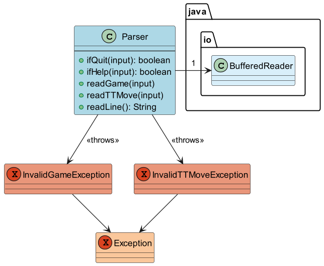
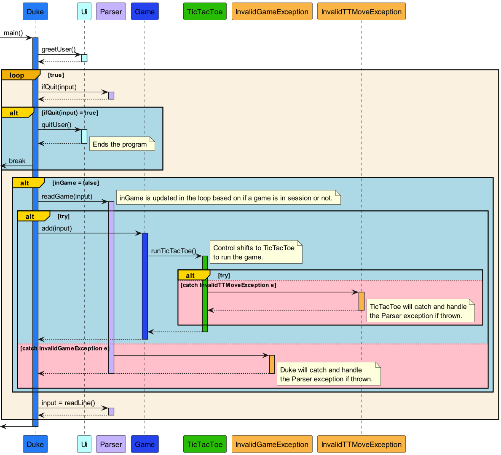

# AeroCade Developer Guide

## Table of Contents

- [Design & Implementation](https://ay2324s2-cs2113-w13-1.github.io/tp/DeveloperGuide.html#design--implementation)
- [Product Scope](https://ay2324s2-cs2113-w13-1.github.io/tp/DeveloperGuide.html#product-scope)
- [User Stories](https://ay2324s2-cs2113-w13-1.github.io/tp/DeveloperGuide.html#user-stories)
- [Non-Functional Requirements](https://ay2324s2-cs2113-w13-1.github.io/tp/DeveloperGuide.html#non-functional-requirements)
- [Glossary](https://ay2324s2-cs2113-w13-1.github.io/tp/DeveloperGuide.html#glossary)
- [Instructions for Manual Testing](https://ay2324s2-cs2113-w13-1.github.io/tp/DeveloperGuide.html#instructions-for-manual-testing)

## Acknowledgements

{list here sources of all reused/adapted ideas, code, documentation, and third-party libraries -- include links to the original source as well}

## Design & Implementation

Here is a quick overview of the main components and how they interact with each other:

- [Parser](https://ay2324s2-cs2113-w13-1.github.io/tp/DeveloperGuide.html#parser-implementation): Reads input
- [Ui](https://ay2324s2-cs2113-w13-1.github.io/tp/DeveloperGuide.html#ui-implementation): The UI of the App
- [Game](https://ay2324s2-cs2113-w13-1.github.io/tp/DeveloperGuide.html#game-implementation): The Interface concerning the games
- [TicTacToe](https://ay2324s2-cs2113-w13-1.github.io/tp/DeveloperGuide.html#tictactoe-implementation): Game 1
- [Hangman](https://ay2324s2-cs2113-w13-1.github.io/tp/DeveloperGuide.html#hangman-implementation): Game 2

### Parser Implementation:
Parser Class (v1.0) reads user input from the standard input stream, checks the input, 
tests the validity, and conveys the validity back to the class it is called from.

Briefly, the Parser class interacts with the main program by reading the inputs and throwing exceptions
if the inputs are unexpected. These exceptions are then handled by the Duke class or the 
TicTacToe class. 

Currently, the Parser class only covers the reading of the chosen game by the user and 
the moves performed in TicTacToe. A future implementation for v2.0 would integrate methods
to read and verify user input for the HangMan class as well, such as readLetters(String: input) 
or readHMMove(String: input).

### UI Implementation:
The `UI` consists of the AeroCade `logo`, the `help` menu, the `tutorial`, and sends farewell to the user upon `quit`

The `UI` component,

* reads user commands using `Parser` component.
* displays a `help` menu with instructions.
* creates a `tutorial` to assist user.

(image)

### Game Implementation:
The `Game` class, is the parent class for our games, `TicTacToe` and `Hangman`.
* Contains an override method that runs the game for TicTacToe and Hangman.
* Contains a method `getHelp` as tutorial guidelines for users for each respective game to teach users on the games rules
* `getHelp` also guides how the game would be controlled on the CLI.
* `getHelp` will be overridden by child classes, `TicTacToe` and `Hangman`.
* ArrayList of `Game` type is created to store multiple instances of `TicTacToe` and `Hangman` to allow many rounds
of either games to be played.
* The `isExit` is a `Boolean` variable to be implemented later on, that checks when a user would want to quit an ongoing game or when a game is ended.

### TicTacToe Implementation:
The `TicTacToe` class, which inherits from the `Game` class, handles the Tic-Tac-Toe game itself!

The `TicTacToe` class:
* reads commands using `Scanner`, after which the input is parsed by the `Parser` class. 
  * Specifically, it takes in values only from `1` to `9`.
* stores the `board` upon which the game is played on. 
  * The `board` is a `String` `array` with `9` slots, indicating the possible inputs from the user.
  * The `board` is also printed at the start of the game and after every move by the user.
* checks the winner using the `checkWinner(int turnCount)` method, which takes in the number of turns taken so far.
  * Returns the following based on the state of the game:
    * `unending` if the game is unfinished or the user inputs `quit`.
    * `X` if the user wins the game
    * `O` if the user loses the game
    * `draw` if the user and the computer draw

### Hangman Implementation:
The `HangMan` class:
* When the game is started, `runHangMan` is called.
* User input is read using `Scanner`. 
  * Available commands currently are only limited to single characters.
    * (A future implementation for v2.0 would be to additionally include the ability to input an entire word for guessing)
* Stores a `wordBank` which contains the list of available words randomly selected for the hangman game.
* Contains attributes of `chosenWordLength` based on the randomly `chosenWord`.
* User inputs are compared against the `chosenWord` to check for similar letters used.
   Each iteration of user input will result in calls of `addGuess`, `printHangMan`, `printLettersGuessed` & `printWordGuesser`.
  * `addGuess` adds the user input to an arraylist<String> of `allGuessedLetters`
    * `printLettersGuessed` then iterates through `allGuessedLetters`, printing each element of the array list.
  * Correctly guessed letters together with `_` blank spaces corresponding to letters not yet guessed, are printed using `printWordGuesser`.
  * Incorrect guesses however lead to the game `state` increasing by 1.
    * `printHangMan` prints a different hangman based on the game `state`. 
    * Should the `state` reach 6, the game is lost.
* `runHangMan` checks for the number of `_` blank spaces left at each iteration of user input.
  * Should the number of `_` be 0, the player has won.

## Product scope

### Target user profile

- Loves to play games and challenge themselves
- Prefers using desktop for entertainment
- Has particular interest in CLI commands
- Enjoys retro-style

### Value proposition

CLI-based games work on different operating systems and environments that support 
command-line interfaces. This means players can enjoy the game no matter what kind 
of computer or setup they use.

## User Stories

|Version| As a ... | I want to ... | So that I can ...|
|--------|----------|---------------|------------------|
|v1.0|new user|see usage instructions|refer to them when I forget how to use the application|
|v2.0|user|find a to-do item by name|locate a to-do without having to go through the entire list|

## Non-Functional Requirements

1. Should work on any mainstream OS as long as it has `Java 11` installed.

## Glossary

* *glossary item* - Definition

## Instructions for Manual Testing

{Give instructions on how to do a manual product testing e.g., how to load sample data to be used for testing}
