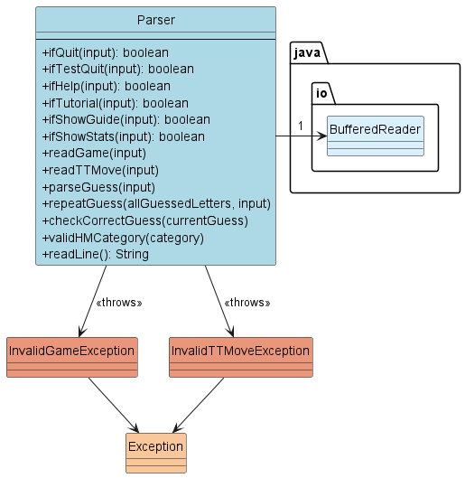
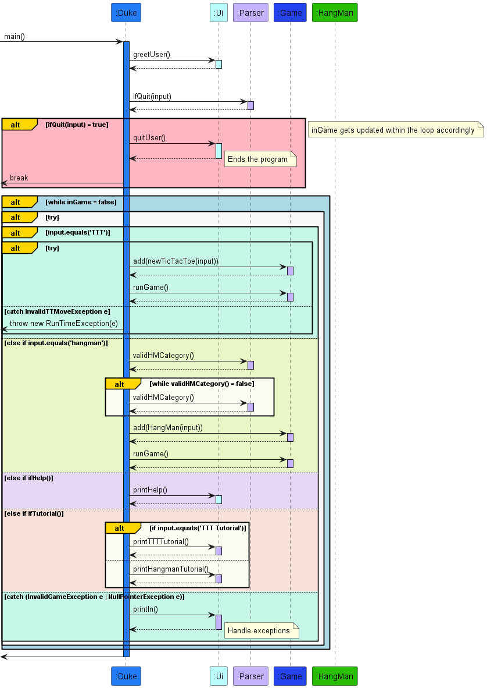

<link rel="stylesheet" href="https://stackpath.bootstrapcdn.com/bootstrap/4.3.1/css/bootstrap.min.css">

# AeroCade Developer Guide

## Table of Contents

- [Design & Implementation](https://ay2324s2-cs2113-w13-1.github.io/tp/DeveloperGuide.html#design--implementation)
- [Product Scope](https://ay2324s2-cs2113-w13-1.github.io/tp/DeveloperGuide.html#product-scope)
- [User Stories](https://ay2324s2-cs2113-w13-1.github.io/tp/DeveloperGuide.html#user-stories)
- [Non-Functional Requirements](https://ay2324s2-cs2113-w13-1.github.io/tp/DeveloperGuide.html#non-functional-requirements)
- [Glossary](https://ay2324s2-cs2113-w13-1.github.io/tp/DeveloperGuide.html#glossary)
- [Instructions for Manual Testing](https://ay2324s2-cs2113-w13-1.github.io/tp/DeveloperGuide.html#instructions-for-manual-testing)

## Design & Implementation

Here is a quick overview of the main components and how they interact with each other:

- [Parser](https://ay2324s2-cs2113-w13-1.github.io/tp/DeveloperGuide.html#parser-implementation): Reads input
- [Ui](https://ay2324s2-cs2113-w13-1.github.io/tp/DeveloperGuide.html#ui-implementation): The UI of the App
- [Game](https://ay2324s2-cs2113-w13-1.github.io/tp/DeveloperGuide.html#game-implementation): The Interface concerning the games
- [TicTacToe](https://ay2324s2-cs2113-w13-1.github.io/tp/DeveloperGuide.html#tictactoe-implementation): TicTacToe Game 
- [Hangman](https://ay2324s2-cs2113-w13-1.github.io/tp/DeveloperGuide.html#hangman-implementation): Hangman Game 

### Parser Implementation:
Parser Class (v2.1) reads user input from the standard input stream, checks the input, 
tests the validity, and conveys the validity back to the class it is called from.

Briefly, the Parser class interacts with the main program by reading the inputs and throwing exceptions or returning specific
values if the inputs are unexpected. This behavior is then handled by the Duke class or TicTacToe class. Parser
also screens for the content of the input, specifically if the content is one of the non-gaming commands such as 'quit'
or 'help'

### UI Implementation:
The `UI` consists of three classes: `Ui.java`, `Render.java`, and `TimerTutorial.java`.
The (partial) class diagram is illustrated below: 

- **Ui Class:** Contains 6 methods that work with the other classes `Render.java` and `TimerTutorial.java`. These
  methods are extracted to display various types of messages and art. These include `greetUser()`,
  `quitUser()`, `printHelp()`, `printTTTTutorial()`, `printHangmanTutorial()`, and `println()`
  - `greetUser()` and `quitUser()` displays the greetings and _randomised_ farewells, including art.
  - `printHelp()` prints the descriptive help message.
  - `printTTTTutorial()` and `printHangmanTutorial()` displays a gameplay tutorial of each game, displaying a frame
    every 4 seconds.
  -  `println()` is a simple and convenient method to call for other classes.

- **Render Class:** Contains all the art and messages that are called in `Ui.java`

- **TimerTutorial Class** Contains two display methods `displayTTTTutorial()` and `displayHangmanTutorial()` which
  displays every frame of the tutorial, and a schedule method `scheduleTutorialFrames(frames, interval)` is used to
  `run()` a frame every 4 seconds.

**The `UI` component,**

* reads user commands using `Parser` component.
* displays various ASCII art, messages and tutorial frames through `Render`.
* creates a `tutorial` to assist user in `TimerTutorial`.
  * Executes scheduling using `java.util.Timer` and `java.util.TimerTask`.
  * `scheduleTutorialFrames(frames, interval)` method automatically schedules and displays tutorial frames at fixed 
  intervals, in this case would be 4 seconds
  * Retrieves tutorial frames from `Render` in `getHangmanFrames()` and `getTTTFrames()`
  * Ignores every user input (except `quit`) during the tutorial, `quit` will exit the tutorial state.
  * `handleTutorial(displayMethod, tutorial name)`method in `Ui` flags the boolean `stopTutorial` as true if `quit` is 
  typed. This cancels the timer in `TimerTutorial` ensuring the exit of tutorial mode.

_A log file will also be made at `FILE_PATH "./text-ui-test/UiLog.log"` at start of program via `setupLogging()` in `Ui`,
that records all Ui-related information and can be used for troubleshooting. The log file will refresh at every start._

❗ Note:  
The UiLog.log file may cause merge conflicts despite being in the .gitignore file. 
Cause of bug is unknown.

_JUnit testing for functionality testing can be found at `UiTest.java` in `./src/main/test/java/seedu.duke`_

### Game Implementation:
The `Game` class, is the parent class for our games, `TicTacToe` and `Hangman`.
* Contains an override method that runs the game for TicTacToe and Hangman.
* Contains a method `howToPlay` as rules guidelines for users for each respective game to teach users on the games rules
* `howToPlay` also guides how the game would be controlled on the CLI.
* `howToPlay` will be overridden by child classes, `TicTacToe` and `Hangman`.
* ArrayList of `Game` type is created to store multiple instances of `TicTacToe` and `Hangman` to allow many rounds
of either games to be played.
* `Game` has variable `gameOutcome` which ranges from 0 to 3. `0` denotes the game was lost, while `1` denotes a win, `2` is draw (only applicable for TTT) and lastly, `3` when a game is quit upon without finishing.
* Game's `gameOutcome` is initialized to be 0 (game lost). Meanwhile, the methods `gameWon`, `gameQuit` and `gameDraw` will change `gameOutcome` based on the actual in-game outcome.
* When `stats` command is called in the CLI, the program iterates through the ArrayList of `Game`, then computes and outputs the player's statistics.

### TicTacToe Implementation:
The `TicTacToe` class, which inherits from the `Game` class, handles the Tic-Tac-Toe game itself!

The `TicTacToe` class:
* reads commands using `Scanner`, after which the input is parsed by the `Parser` class. 
  * Specifically, it takes in values only from `1` to `9`.
* stores the `board` upon which the game is played on. 
  * The `board` is a `String` `array` with `9` slots, indicating the possible inputs from the user.
  * The `board` is also printed at the start of the game and after every move by the user.
* has a perfect `TTT` algorithm in `computerBestMove(String[] board, int turnCount)`, and should the player choose to play against the `hard` computer, they will never win.
  * also has an `easy` mode, which is really just randomly populating the board.
* checks the winner using the `checkWinner(int turnCount)` method, which takes in the number of turns taken so far.
  * Returns the following based on the state of the game:
    * `unending` if the game is unfinished or the user inputs `quit`.
    * `X` if the user wins the game
    * `O` if the user loses the game
    * `draw` if the user and the computer draw
* outputs very stylised `ui` elements that improve player interaction and engagement!

### Hangman Implementation:
The `HangMan` class:
* When the game is started, `runHangMan` is called.
* User input is read using `Scanner`. 
  * Available commands currently are only limited to single characters.
    * (A future implementation for v2.0 would be to additionally include the ability to input an entire word for guessing)
* Stores a `wordBank` which contains the list of available words randomly selected for the hangman game.
* Contains attributes of `chosenWordLength` based on the randomly `chosenWord`.
* User inputs are compared against the `chosenWord` to check for similar letters used.
   Each iteration of user input will result in calls of `addGuess`, `printHangMan`, `printLettersGuessed` & `printWordGuesser`.
  * `addGuess` adds the user input to an arraylist<String> of `allGuessedLetters`
    * `printLettersGuessed` then iterates through `allGuessedLetters`, printing each element of the array list.
  * Correctly guessed letters together with `_` blank spaces corresponding to letters not yet guessed, are printed using `printWordGuesser`.
  * Incorrect guesses however lead to the game `state` increasing by 1.
    * `printHangMan` prints a different hangman based on the game `state`. 
    * Should the `state` reach 6, the game is lost.
* `runHangMan` checks for the number of `_` blank spaces left at each iteration of user input.
  * Should the number of `_` be 0, the player has won.

## Product scope

### Target user profile

- Loves to play games and challenge themselves
- Prefers using desktop for entertainment
- Has particular interest in CLI commands
- Enjoys retro-style

### Value proposition

CLI-based games work on different operating systems and environments that support 
command-line interfaces. This means players can enjoy the game no matter what kind 
of computer or setup they use.

## User Stories

|Version| As a ... | I want to ... | So that I can ...|
|--------|----------|---------------|------------------|
|v1.0|new user|see usage instructions|refer to them when I forget how to use the application|
|v2.0|user|find a to-do item by name|locate a to-do without having to go through the entire list|

## Non-Functional Requirements

1. Should work on any mainstream OS as long as it has `Java 11` installed.

## Glossary

* *glossary item* - Definition

## Instructions for Manual Testing

{Give instructions on how to do a manual product testing e.g., how to load sample data to be used for testing}
